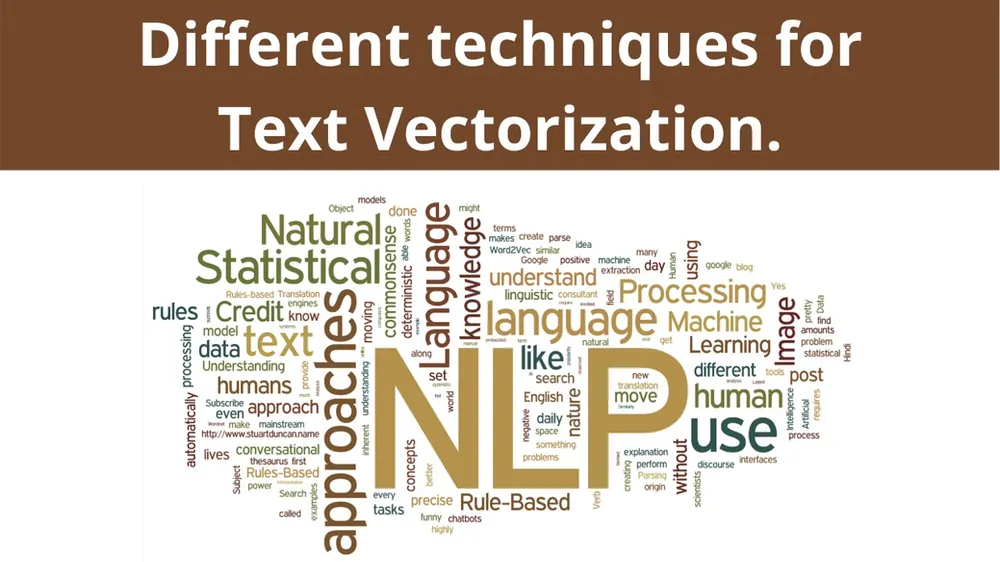

# Procesamiento Natural del Lenguaje (PNL) CEIA

## Módulos y Proyectos

1. **Vectorización**
   - En este módulo, exploramos la esencia de la vectorización en el procesamiento de lenguaje natural. Se abordaron técnicas para representar palabras y documentos como vectores numéricos, un paso crucial para habilitar el análisis y modelado de texto.

   

2. **Bot de Consulta Abierta y Respuestas con DNN + Spacy**
   - Construimos un bot capaz de manejar consultas abiertas y ofrecer respuestas precisas mediante el uso de redes neuronales profundas (DNN) y la biblioteca de procesamiento de lenguaje natural, Spacy.

   

3. **Custom Embeddings con Gensim**
   - Utilizando letras de canciones de bandas, generamos embeddings personalizados. Este enfoque permitió que los vectores capturaran la esencia única de cómo las bandas emplean las palabras en sus creaciones artísticas.

   

4. **Predicción de Próxima Palabra con Embeddings y LSTM en Keras**
   - Exploramos la creación de embeddings de palabras basados en el contexto de documentos o corpus utilizando la capa Embedding de Keras. Estos embeddings se combinaron con capas LSTM para predecir la siguiente palabra probable en un contexto dado.

   

5. **Análisis de Sentimientos con Embeddings + LSTM**
   - Este módulo se centró en analizar el sentimiento en las críticas de compradores de ropa. Utilizando embeddings y capas LSTM, se creó un modelo capaz de evaluar la opinión de los compradores y la puntuación asignada a los productos.

   

6. **LSTM Bot QA para Conversational Intelligence**
   - Utilizando datos del desafío ConvAI2, desarrollamos un BOT basado en LSTM para responder preguntas de los usuarios. Este proyecto implicó la creación de un modelo capaz de comprender y responder preguntas de manera coherente en conversaciones en inglés.

   
